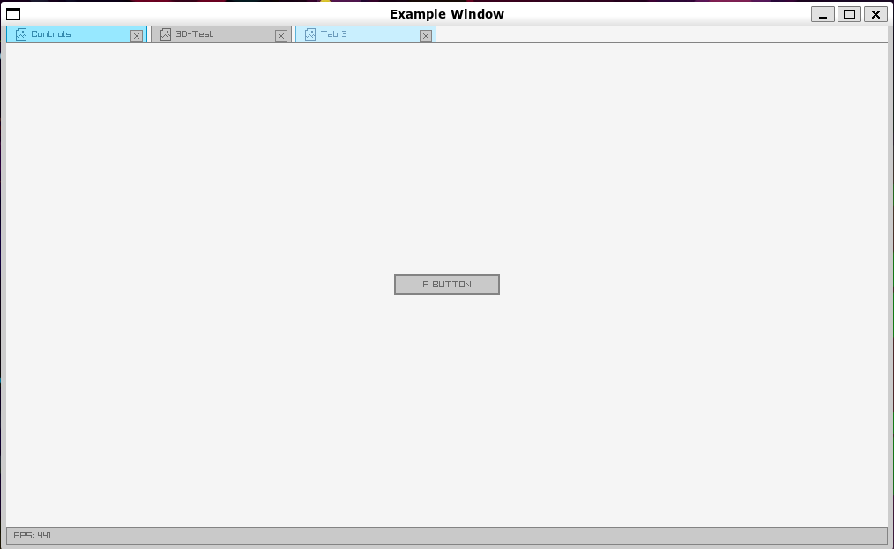

# raylib-template



Because of the submodules, this repo needs to be cloned using:
```
git clone --recursive https://github.com/TobiDeBoumaa/raylib-template.git
```

Build using:
```
cmake -B build
cmake --build build
```

<details>
<summary>Requirements Arch Linux</summary>
  
```
pacman -S glfw-x11
```

</details>
